# ComfyUI Content Viewer


A powerful, extensible ComfyUI custom node with a modular **Views Extension System** that renders content in a secure embedded iframe viewer. Views are dynamically loaded and can be added, removed, or modified without touching core code.

<details>
<summary><strong>Screenshots</strong></summary>

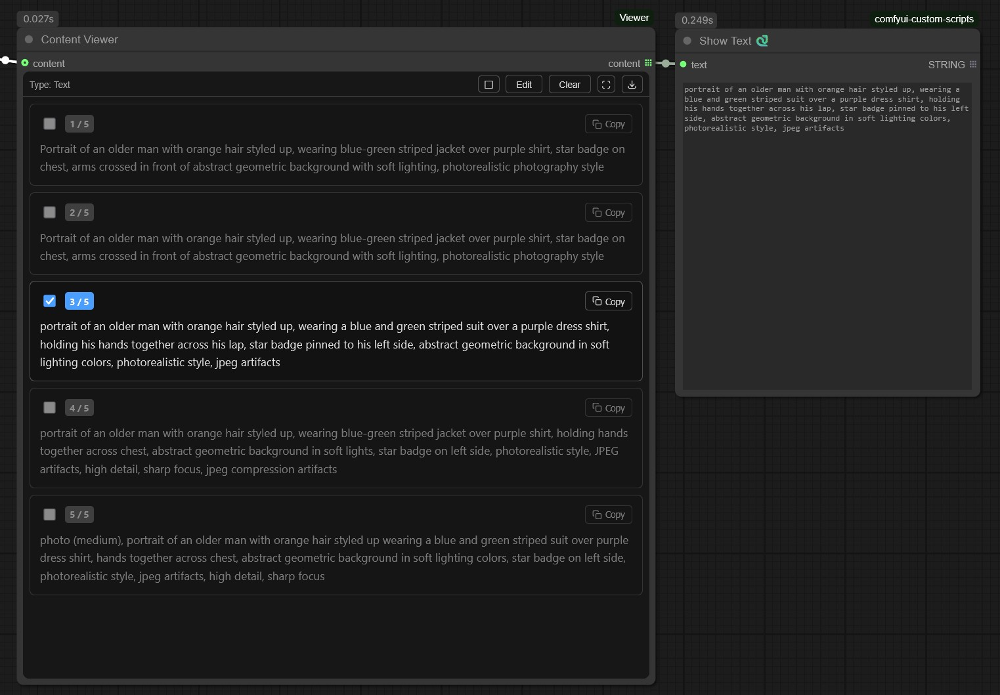
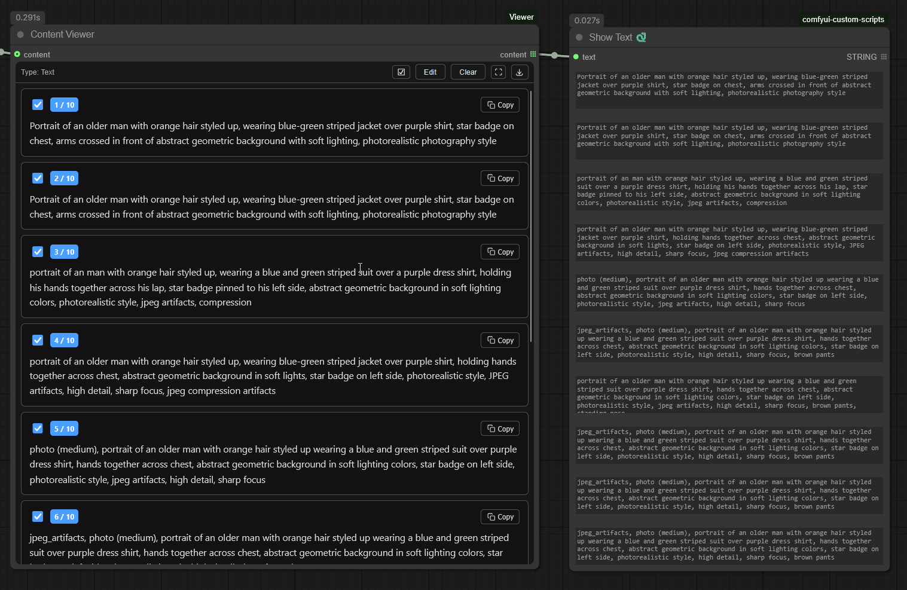
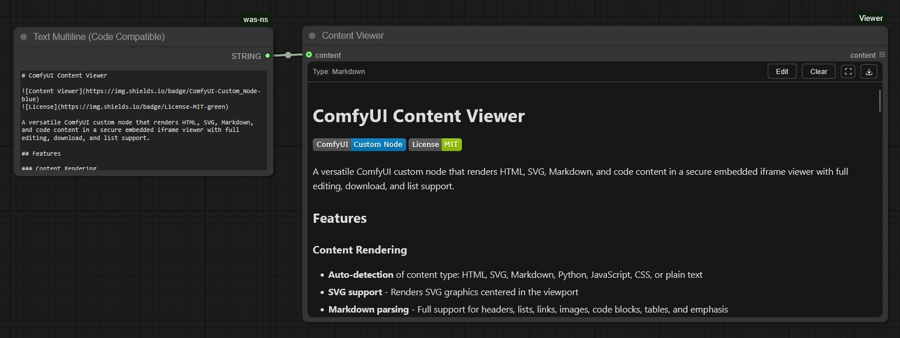
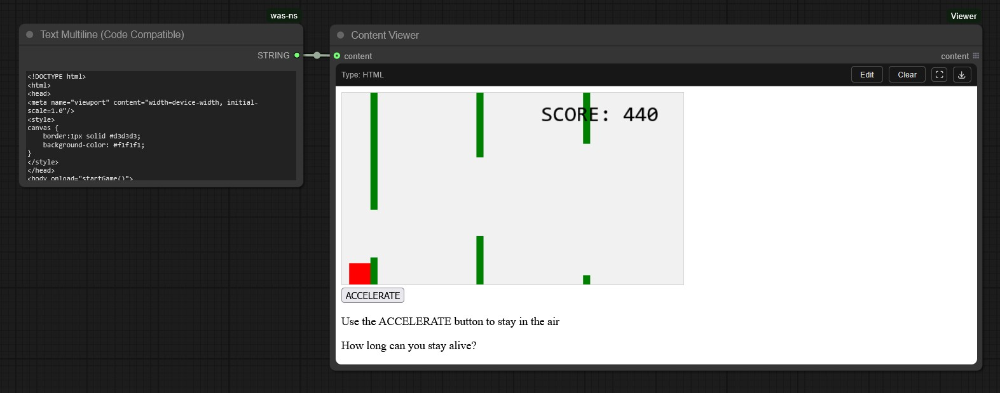
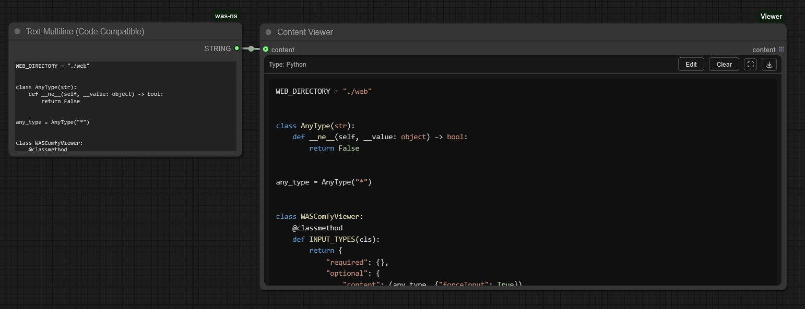
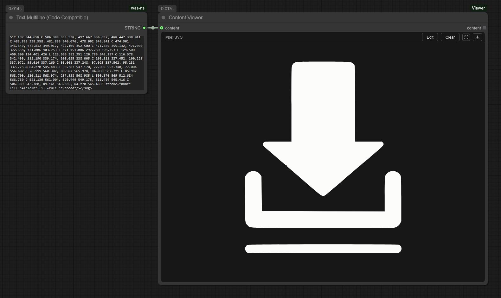
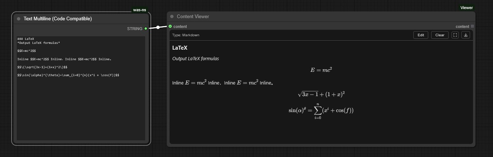
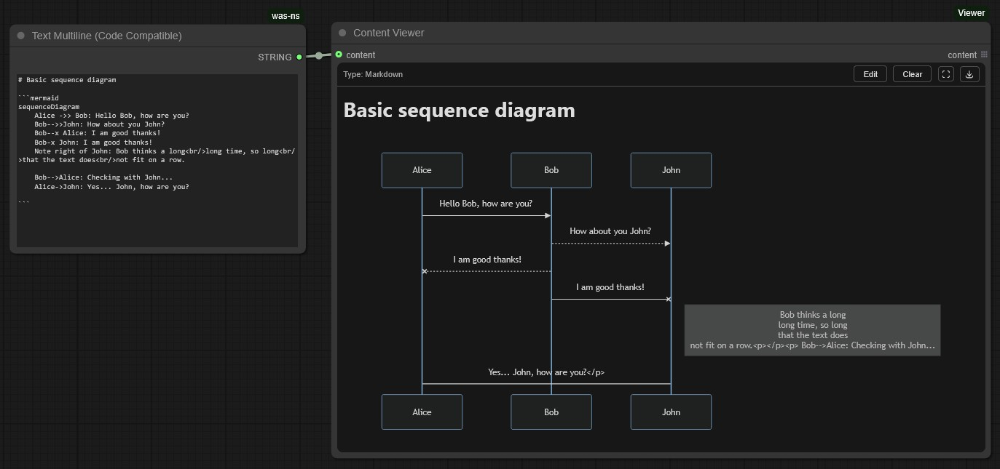

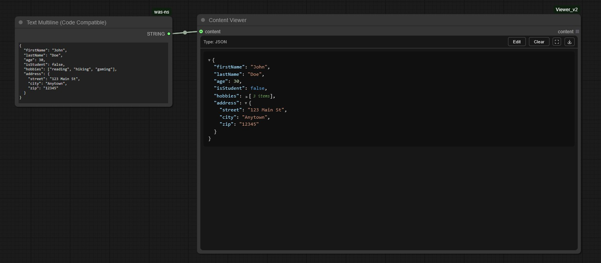
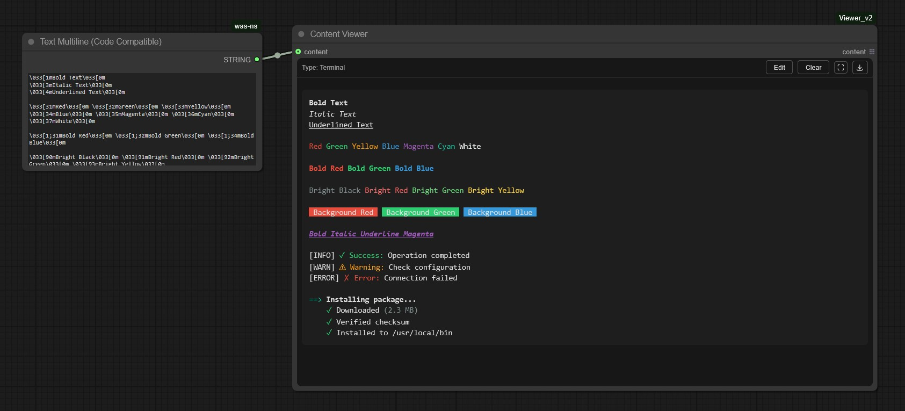
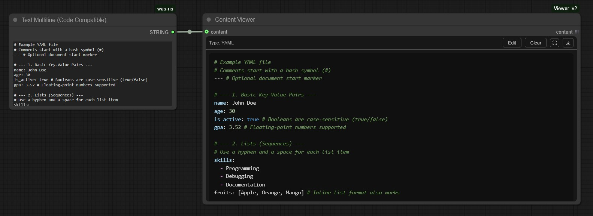
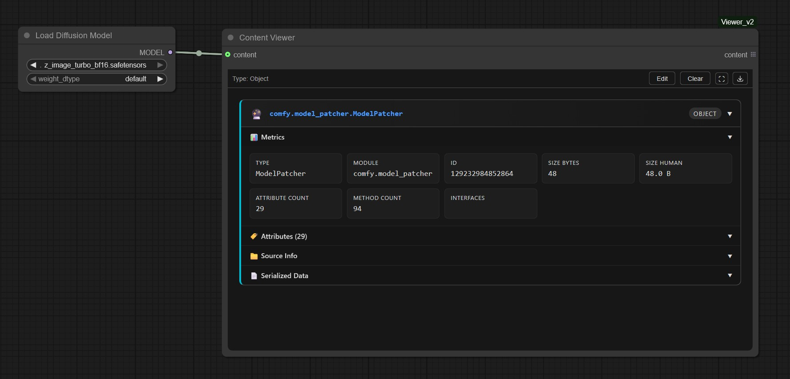
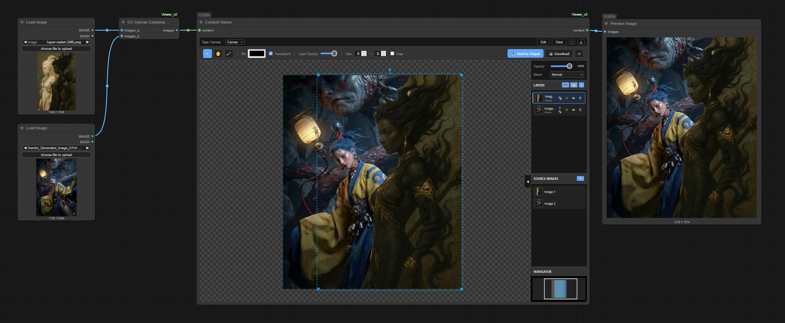

</details>

## Features

### Views Extension System
- **Modular architecture** - Each content type is handled by its own view extension
- **Dynamic loading** - Views are auto-discovered from `web/views/view_manifest.js`
- **Priority-based detection** - Higher priority views are checked first for content matching
- **Extensible** - Add custom views without modifying core viewer code
- **Theme integration** - All views receive ComfyUI theme tokens for consistent styling

### Multi-View Support
- **Automatic detection** - When multiple views can handle the same content, a view selector appears
- **View switching** - Toggle between different visualizations of the same data (e.g., tensor as Canvas vs Object inspector)
- **Priority-based default** - The highest priority matching view is shown by default
- **Common use case** - IMAGE tensors are detected by both Canvas (for compositing) and Object (for metrics/inspection) views

### Controls
- **Edit** - Modify content directly in the node (supports both single and list content)
- **Clear** - Reset all content
- **Fullscreen** - Expand viewer to full screen (press Escape to exit)
- **Download** - Save content with auto-detected file extension
  - Single content → Downloads with appropriate extension (`.html`, `.svg`, `.md`, `.py`, etc.)
  - List content → Downloads as `.zip` containing individually named files

### String List Support
- **Multiple items** - Displays list  inputs as individual indexed containers
- **Per-item checkboxes** - Filter which items to include in output
- **Per-item copy buttons** - Copy individual list items to clipboard
- **Per-item editing** - Edit each list item in its own textarea

### Data Flow
- **Flexible input** - Accepts any type via `content` input (STRING, lists, objects, IMAGE tensors)
- **Content priority** - User edits > Backend execution > Connected content
- **Workflow persistence** - Manual edits saved with the workflow

### Security
- **Sandboxed iframe** - Content runs in isolated sandbox without access to parent page
- **No same-origin** - Iframe cannot access ComfyUI's JavaScript context or localStorage

---

## Built-in Views

The Content Viewer includes 12 built-in views, listed by detection priority:

| View | Priority | Detection | Description |
|------|----------|-----------|-------------|
| **SVG** | 110 | `<svg` tag with xmlns | Renders SVG graphics centered in viewport |
| **HTML** | 100 | `<!DOCTYPE`, `<html`, common HTML tags | Full HTML rendering with scripts |
| **Canvas** (alpha wip) | 95 | JSON with `type: "canvas_composer"` | Beta implementation of a infinite canvas image compositor with layers |
| **JSON** | 90 | Valid JSON starting with `{` or `[` | Collapsible tree view with syntax highlighting |
| **Terminal** | 80 | ANSI escape codes (`\x1b[`, `\033[`) | Colored terminal output parser |
| **Markdown** | 70 | Headers, lists, links, code blocks | Full MD with Mermaid diagrams & KaTeX math |
| **Python** | 60 | `import`, `def`, `class`, `self.` | Prism.js syntax highlighting |
| **JavaScript** | 55 | `function`, `const`, `let`, arrow functions | Prism.js syntax highlighting |
| **CSV** | 50 | Comma-separated values across lines | Styled table rendering |
| **CSS** | 45 | Selectors with `{}`, properties | Prism.js syntax highlighting |
| **YAML** | 40 | Key-value pairs, `---` markers | Syntax highlighted display |
| **Text** | 0 | Default fallback | Monospace plain text |

### View Details

<details>
<summary><strong>Canvas View</strong> - Infinite canvas image compositor</summary>

The Canvas view provides a full-featured image compositing workspace:

- **Layer management** - Add, reorder, hide/show, delete layers
- **Transform tools** - Move, scale, rotate layers with handles
- **Brush tools** - Paint, erase, clone stamp with adjustable size/hardness/opacity
- **Layer effects** - Opacity, blend modes (16 modes), stroke, shadow
- **Layer masks** - Non-destructive masking with brush tools
- **Export** - Download PNG or send composite to node output as IMAGE tensor
- **Navigator** - Mini-map for large canvas navigation
- **Keyboard shortcuts** - V (select), H (pan), B (brush), Delete, Ctrl+Z/Y

The Canvas view outputs `IMAGE` and `MASK` tensors that can be connected to other ComfyUI nodes.

</details>

<details>
<summary><strong>Markdown View</strong> - Rich text with diagrams and math</summary>

Supports full Markdown syntax plus:

- **Mermaid diagrams** - Flowcharts, sequence diagrams, etc. in ` ```mermaid ` blocks
- **KaTeX math** - LaTeX formulas via `$$...$$` (block) or `$...$` (inline)
- **Tables** - Styled with zebra striping
- **Code blocks** - Syntax highlighted with Prism.js
- **Task lists** - Checkbox items `- [x]` and `- [ ]`

</details>

<details>
<summary><strong>JSON View</strong> - Interactive tree viewer</summary>

- **Collapsible nodes** - Click to expand/collapse objects and arrays
- **Syntax highlighting** - Keys, strings, numbers, booleans, null
- **Copy on click** - Click any value to copy it
- **Nested formatting** - Proper indentation for deep structures

</details>

<details>
<summary><strong>Terminal View</strong> - ANSI escape code parser</summary>

Renders terminal output with full ANSI support:

- **16 colors** - Standard terminal colors
- **256 colors** - Extended color palette
- **24-bit colors** - True color RGB
- **Styles** - Bold, italic, underline, strikethrough
- **Reset codes** - Proper handling of reset sequences

</details>

---

## Installation

**Option A (git clone)**
```bash
cd ComfyUI/custom_nodes
git clone https://github.com/WASasquatch/ComfyUI_Viewer.git
```

**Option B (ComfyUI Manager)**
- Open Manager and search for **ComfyUI_Viewer**

**Option C (zip)**
- Download and extract to `ComfyUI/custom_nodes/ComfyUI_Viewer`

---

## Usage

### Basic Usage
1. Add the **Content Viewer** node (found in `WAS/View` category)
2. Connect any STRING output to the `content` input
3. Content type is auto-detected and rendered with the appropriate view

### As a Notes/Documentation Node
1. Add the **Content Viewer** node
2. Click **Edit** in the controls bar
3. Enter your HTML, Markdown, or text content
4. Click **Save** to render

### Using the Canvas Compositor
1. Connect IMAGE outputs to the Canvas Composer node
2. Images appear in the source panel - drag them onto the canvas
3. Use transform handles to position and scale
4. Use brush tools to paint or mask
5. Click **Send to Output** to pass the composite downstream

---

## How to Add Extensions

The Content Viewer has a dual extension system: **frontend views** for rendering content in the browser, and **backend parsers** for processing Python objects into displayable data.

### Extension Architecture Overview

```
┌─────────────────────────────────────────────────────────────┐
│                        ComfyUI                              │
│  ┌─────────────┐     ┌──────────────┐     ┌─────────────┐  │
│  │ Input Data  │────▶│Backend Parser│────▶│  Frontend   │  │
│  │ (tensors,   │     │ (Python)     │     │  View (JS)  │  │
│  │  objects)   │     │              │     │             │  │
│  └─────────────┘     └──────────────┘     └─────────────┘  │
│                             │                    │          │
│                             ▼                    ▼          │
│                      display_content ──────▶ render()       │
└─────────────────────────────────────────────────────────────┘
```

- **Backend Parsers** (`modules/parsers/*_parser.py`) - Process Python objects (tensors, images, custom types) into JSON/strings for the frontend
- **Frontend Views** (`web/views/*.js`) - Detect content patterns and render HTML in the sandboxed iframe

---

## Adding a Frontend View

Frontend views handle content rendering in the browser. They detect content patterns and produce HTML.

### Quick Start

1. **Create your view file** in `web/views/`:

```javascript
// web/views/myview.js
import { BaseView, escapeHtml } from "./base_view.js";

class MyView extends BaseView {
  static id = "myview";           // Unique identifier
  static displayName = "My View"; // Shown in UI
  static priority = 50;           // Higher = checked first

  // Return score > 0 if this view should handle the content
  static detect(content) {
    if (content.includes("MY_SPECIAL_MARKER")) {
      return 100; // High confidence
    }
    return 0; // Cannot handle
  }

  // Render content to HTML for the iframe
  static render(content, theme) {
    return `<div style="color: ${theme.fg}; background: ${theme.bg};">
      <h1>My Custom View</h1>
      <pre>${escapeHtml(content)}</pre>
    </div>`;
  }

  // Optional: Add custom CSS
  static getStyles(theme) {
    return `
      body { padding: 16px; }
      h1 { color: ${theme.accent}; }
    `;
  }
}

export default MyView;
```

2. **Register in the manifest** - Add your file to `web/views/view_manifest.js`:

```javascript
export const VIEW_FILES = [
  "canvas.js",
  "html.js",
  // ... existing views ...
  "myview.js",  // Add your view here
];
```

3. **Restart ComfyUI** - Your view will be automatically loaded

### BaseView Interface

All views extend `BaseView` and can override these methods:

| Method | Required | Description |
|--------|----------|-------------|
| `static id` | ✓ | Unique string identifier |
| `static displayName` | ✓ | Human-readable name for UI |
| `static priority` | ✓ | Detection priority (higher = checked first) |
| `static detect(content)` | ✓ | Return score (0-100+) for content matching |
| `static render(content, theme)` | ✓ | Return HTML string for iframe body |
| `static getStyles(theme)` |  | Return CSS string for iframe |
| `static getScripts()` |  | Return `<script>` tags for iframe |
| `static loadScripts(basePath)` |  | Async load external scripts |
| `static isReady()` |  | Return false if scripts still loading |
| `static getContentMarker()` |  | Return marker prefix (e.g., `$MY_VIEW$`) |
| `static getMessageTypes()` |  | Return array of postMessage types to handle |
| `static handleMessage(type, data, node, app, source)` |  | Handle iframe messages |
| `static getStateFromWidget(node)` |  | Extract saved state from node |
| `static injectState(content, state)` |  | Inject state into content before render |
| `static usesBaseStyles()` |  | Return false to skip base iframe CSS |

### Theme Tokens

The `theme` object passed to `render()` and `getStyles()` contains:

```javascript
{
  bg: "#1a1a1a",        // Background color
  fg: "#cccccc",        // Foreground text color
  border: "#333333",    // Border color
  accent: "#4a9eff",    // Accent/link color
  // ... additional tokens
}
```

---

## Adding a Backend Parser

Backend parsers process Python objects (tensors, custom types) into content the frontend can display. They are required when:

- Input data is **not a string** (e.g., IMAGE tensors, model objects)
- You need to **convert Python objects** to JSON/strings for the frontend view
- Your view needs to **output data back to the workflow** (e.g., Canvas outputs IMAGE tensors)

### Parser Discovery

Parsers are **auto-discovered** from `*_parser.py` files in `modules/parsers/`. Simply create a file ending in `_parser.py` and define a class extending `BaseParser`.

### Minimal Example: Dictionary Parser

This example shows a simple parser that handles Python dictionaries:

```python
# modules/parsers/dict_parser.py
"""Minimal parser example - handles Python dictionaries."""

import json
import hashlib
from .base_parser import BaseParser


class DictParser(BaseParser):
    """Parser for dictionary input."""
    
    PARSER_NAME = "dict"
    PARSER_PRIORITY = 50
    OUTPUT_MARKER = "$WAS_DICT$"
    
    @classmethod
    def detect_input(cls, content) -> bool:
        """Return True if content is a dictionary."""
        return isinstance(content, dict)
    
    @classmethod
    def handle_input(cls, content, logger=None) -> dict:
        """Convert dictionary to JSON for frontend display."""
        json_str = json.dumps(content, indent=2, default=str)
        content_hash = hashlib.md5(json_str.encode()).hexdigest()[:8]
        
        return {
            "display_content": cls.OUTPUT_MARKER + json_str,
            "output_values": [content],
            "content_hash": f"dict_{content_hash}",
        }
    
    @classmethod
    def detect_output(cls, content: str) -> bool:
        """Check if content has our marker."""
        return isinstance(content, str) and content.startswith(cls.OUTPUT_MARKER)
    
    @classmethod
    def parse_output(cls, content: str, logger=None) -> dict:
        """Parse JSON back to dictionary."""
        json_str = content[len(cls.OUTPUT_MARKER):]
        data = json.loads(json_str)
        
        return {
            "output_values": [data],
            "display_text": f"Dict with {len(data)} keys",
            "content_hash": f"dict_out_{hash(json_str[:50]) & 0xFFFFFFFF}",
        }
```

### BaseParser Interface Reference

| Method | Required | Description |
|--------|----------|-------------|
| `PARSER_NAME` | ✓ | Unique string identifier (should match frontend view id) |
| `PARSER_PRIORITY` | ✓ | Detection priority (higher = checked first) |
| `OUTPUT_MARKER` |  | String prefix for output content detection |
| `detect_input(content)` |  | Return `True` if parser handles this input type |
| `handle_input(content, logger)` |  | Process input, return `{display_content, output_values, content_hash}` |
| `detect_output(content)` |  | Return `True` if content has this parser's output marker |
| `parse_output(content, logger)` |  | Convert frontend output to backend types |
| `detect_state(state_data)` |  | Return `True` if parser handles this state data |
| `parse_state(state_data, logger)` |  | Parse view state from frontend |
| `detect_display_content(content)` |  | Return `True` if parser should prepare display content |
| `prepare_display(content, logger)` |  | Prepare content for display |
| `get_default_outputs(content, output_types, logger)` |  | Return default output values |

### Parser + View Integration

For a complete extension, you need both a backend parser and frontend view:

1. **Parser** (`modules/parsers/myext_parser.py`):
   - `detect_input()` → Returns `True` for your data type
   - `handle_input()` → Converts Python objects to JSON with marker prefix
   - `parse_output()` → Converts frontend data back to Python types (if needed)

2. **View** (`web/views/myext.js`):
   - `detect()` → Checks for marker prefix or content pattern
   - `render()` → Generates HTML from the JSON data
   - `handleMessage()` → Sends data back to backend (if needed)

**Marker Convention**: Use `$WAS_VIEWNAME$` prefix (e.g., `$WAS_AUDIO$`) so the frontend view can reliably detect content meant for it.

### Multi-View Detection

When multiple parsers return `True` from `detect_input()` for the same content, the system creates a **multi-view payload**:

```python
# Example: IMAGE tensor detected by both CanvasParser and ObjectParser
# Result: User sees a view switcher to toggle between Canvas and Object views
```

This allows users to choose how they want to visualize the data:
- **Canvas view** for compositing and editing
- **Object view** for inspecting tensor metrics and statistics

---

## Troubleshooting

### Content not updating
- Ensure the connected node is executing (queue the workflow)
- Try disconnecting and reconnecting the input

### View not detecting content
- Check the browser console (F12) for `[WAS Viewer]` messages
- Verify your view's `detect()` returns a score > 0 for your content
- Check priority - higher priority views are tested first

### Canvas images not loading
- Ensure images are in ComfyUI's input directory.
  - Search for a folder that looks like `was_viewer_032bb95c` where the last part is a unique hash for that nodes canvas content. 
- Check for CORS errors in browser console

### Custom view not appearing
- Verify the file is listed in `view_manifest.js`
- Check for JavaScript errors in browser console
- Ensure `export default YourViewClass` is present

---

## Third-Party Licenses

This project includes the following third-party libraries:

| Library | License | Description | Location |
|---------|---------|-------------|----------|
| [Prism.js](https://prismjs.com/) | MIT | Syntax highlighting for code blocks | `web/views/code_scripts/` |
| [KaTeX](https://katex.org/) | MIT | LaTeX math rendering | `web/views/markdown_scripts/` |
| [Mermaid](https://mermaid.js.org/) | MIT | Diagram and flowchart rendering | `web/views/markdown_scripts/` |
| [KaTeX Fonts](https://katex.org/) | SIL OFL 1.1 | Math fonts for KaTeX | `fonts/` |

Full license texts are included with each library in their respective directories.

---

## License

MIT License - See [LICENSE](LICENSE) for details
